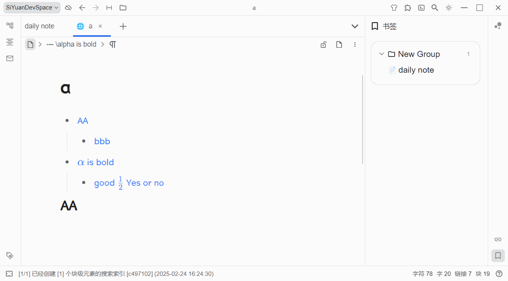
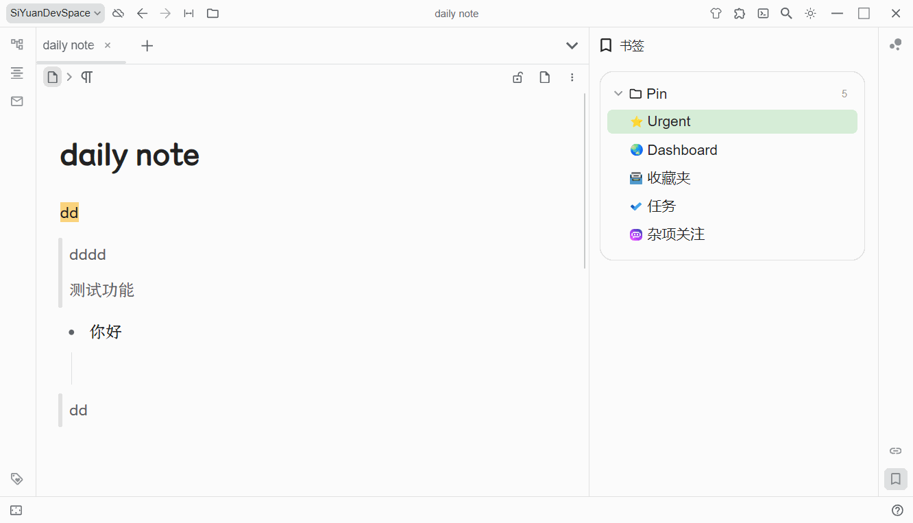
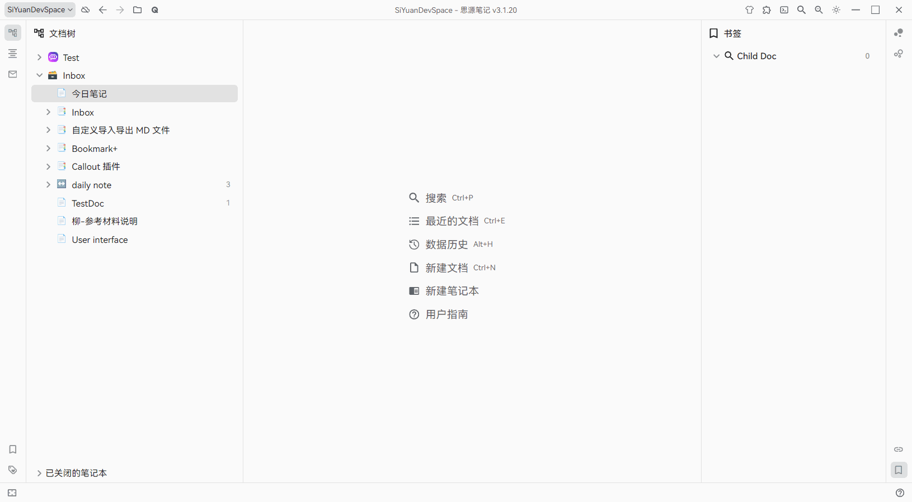
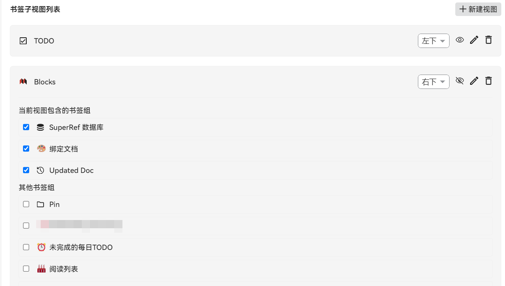
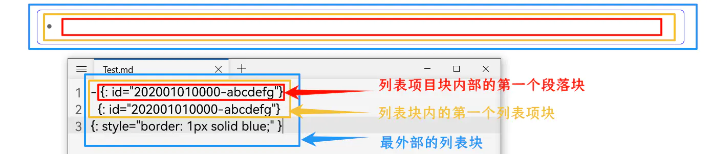

本插件实现了一个更加用户友好的书签功能。支持拖放添加、书签组管理、复制链接、动态查询等功能。

> 🔔 注意！本插件默认会屏蔽侧边栏当中思源的内置书签按钮！你可以在设置当中禁用这一默认行为。

以下介绍最核心的功能，其他细节功能请自行探索。

> * 如果图片无法显示，可以访问 [线上文档](https://flowus.cn/share/d84d5d98-cc4c-471b-ba2b-62338bb88511?code=80RAFK) 查看
> * 如果您对本项目还满意，欢迎来[Github主页](https://github.com/frostime/sy-bookmark-plus)为项目点 star

📝 更新日志见: [CHANGELOG.md](./CHANGELOG.md)

## 书签组

在顶栏中点击「添加」，可以新建一个书签组，书签组分类两种类型：

* 静态书签组：普通的书签组，由用户手动增加、减少书签项目

  * 支持自定义拖放功能
  * 支持将书签组内项目移动到不同组内
* 动态书签组：基于查询的动态书签组，将查询结果列举在侧栏中；支持以下规则

  * SQL 查询：输入 sql 查询语句
  * 反向链接：输入块 ID，查询对应块的反链；用户可以指定后处理方案

    1. 无后处理：即查询到什么块，就直接显示什么块
    2. 容器首个子块：当搜索到的引用块为列表项、引述块的第一个子块时，显示完整的容器块
    3. 显示为文档块：显示引用块所在的文档，而非引用块本身

    > 注：如果你对「后处理方案」表示疑惑，不能理解，那么请参考 [Q&amp;A 小节](#反向链接规则的后处理方案是什么)
    >
  * 块属性：查询指定块属性，输入需要查询的块属性，可以是：

    1. ​`<属性名>`​，例如 `custom-b`​ ，返回所有含有 `custom-b`​ 自定义属性的块
    2. ​`<属性名>=<val>`​，例如 `bookmark=测试`​，返回所有「测试」书签内的块
    3. ​`<属性名> like <val>`​
  * Javascript：执行编写的 javascript 代码，`return`​ 一个 `Block`​ 的数组，或者 `Block Id`​ 的数组

    * 关于 Javascript 查询，详细请阅读后面的说明

​​

### Javascript 查询

javascript 查询中编写的代码，会被放到一个 `async`​ 函数当中，他需要返回一个 `Block[]`​ 数组（或者 Block ID 的数组）。

```js
async function main(){
    ${inputCode}
}
return main();
```

在代码中，可以访问一个 `kit`​ 对象，内置了一些常用的查询函数。

```ts
const kit: {
    request: (url: string, data: any) => Promise<unknown>, // request backend api
    sql: (sqlCode: string) => Promise<unknown[]>; // fetch sql backend api
    backlink: (id: BlockId, limit?: number) => Promise<Block[]>;
    attr: (name: string, val?: string, valMatch?: '=' | 'like') => Promise<Block[]>
};
```

⭐ 更加推荐和 `Query & View`​ 插件配合使用，利用插件提供的 `Query`​ 来进行查询。例如以下的代码：

```js
let todo = await Query.task(Query.utils.thisYear(), 64);
return todo.sorton('created', 'desc');
```

## 添加项目

### 静态组

在静态书签组当中，你可以通过这几种方法添加书签项目：

1. 编辑器块拖放：在编辑器中，直接将块的图标拖入书签组内

    ​​
2. Tab 标签页拖放：可以直接将当前编辑的文档的页签拖放到书签组中

    ​​
3. 书签组右键菜单中添加：

    1. 从剪贴板中添加：你可以复制一个块的 ID、引用、链接，插件会自动识别并将其添加到书签组中
    2. 添加当前文档块：会将当前正在编辑的文档添加到书签组中

​​

### 动态组

动态书签组主要通过执行查询来获取书签项目。

1. 全局更新：点击顶栏的更新按钮，更新所有的书签组
2. 右键菜单：点击动态组右键菜单，重新在当前组中执行查询，并获取最新的书签项目

​​

### 变量渲染

在动态组中，支持基于 `{{VarName}}`​ 的变量渲染。变量渲染允许你在规则中插入一些动态变量，这些变量会在渲染时被替换为实际的值。目前支持的变量包括：

* ​`{{CurDocId}}`​：当前活动文档的 ID
* ​`{{CurRootId}}`​：`{{CurDocId}}`​ 的别名，二者等价
* ​`{{yyyy}}`​：当前年份（四位数）
* ​`{{MM}}`​：当前月份（两位数）
* ​`{{dd}}`​：当前日期（两位数）
* ​`{{yy}}`​：当前年份的后两位数
* ​`{{today}}`​：当前日期（等价于 `{{yyyy}}{{MM}}{{dd}}`​）

案例1，SQL 规则：查看本月所有更新

```sql
select * from blocks where
type='d' and updated like '{{yyyy}}{{MM}}%'
order by updated desc
```

案例2，属性规则：查看本月所有日记

```
custom-dailynote-% like {{yyyy}}{{MM}}%
```

案例3，反链规则：查看当前文档的反链:

```
{{CurDocId}}
```

你可以在书签设置当中开启「**切换文档时刷新相关组**」功能，这样当打开新的文档的时候，相关的书签组会自动刷新。

​​

## 书签项目

* 点击项目，跳转对应的块
* 悬浮在块标上，可以预览块的内容

  ​​
* 拖放调整书签位置

  ​​
* 右键菜单中支持更多功能~

  ​​

## 书签子视图 (2.0 版)

2.0版本引入新功能**多书签子视图**，用于解决书签组堆积导致的侧栏拥挤问题。现在您可以：

1. 通过设置 →「子视图管理」新建独立侧边栏
    ​
2. 自由分配书签组到不同视图：每个子视图可包含任意数量的书签组  

    ​​
3. 重启后自动固定到独立Dock栏

## 插件设置

​​

* 替换内置书签：如果开启，在插件在启动的时候会自动屏蔽默认的思源书签，并且覆盖书签的快捷键（默认为 Alt + 3）
* 展示样式：插件提供了两种样式

  * 书签样式：和思源内置的书签一致

    ​​
  * 卡片样式：各个书签组以卡片的样式呈现

    ​​
* 隐藏项目：书签项目可能由于被删除、或者块所在的笔记本被关闭而无法被索引到

  * 隐藏关闭项目：开启后，隐藏那些来自被关闭的笔记本中的项目
  * 隐藏无效项目：开启后，隐藏那些被删除的项目
* 书签组

  * 展示了所有的书签组
  * 鼠标拖放可以调整各个书签组的先后顺序
  * 可以通过取消显示，来隐藏一些暂时不需要的书签组

## Styling

插件当中的每个组件部分都有特定的 `class`​ 名称，如果有自定义需求（例如修改字体）可以自行编写 css 样式并放入思源的「代码片段」中。

* 顶层：`.custom-bookmark-body`​

  * 卡片模式：`.custom-bookmark-body.card-view`​
  * 卡片模式下的背景颜色基于两个 css 变量：

    * 底层背景颜色：`--fmisc-bookmark-body-bg__card-view`​，默认为 `var(--b3-theme-surface-light)`​
    * 卡片背景颜色：`--fmisc-bookmark-group-bg__card-view`​，默认为 `var(--b3-theme-background)`​
* 各个书签组：`.custom-bookmark-group`​

  * 书签组的标头：`.custom-bookmark-group-header`​
  * 书签列表：`.custom-bookmark-group-list`​
* 各个书签项目：`.custom-bookmark-item`​

案例：

* 修改书签项目的字体

  ```css
  .custom-bookmark-item.b3-list-item {
    font-size: 20px;
    line-height: 24px;
  }
  ```
* 修改卡片背景颜色：

  ```css
  :root {
      --fmisc-bookmark-body-bg__card-view: white;
      --fmisc-bookmark-group-bg__card-view: grey;
  }
  ```

## `BookmarkPlusSDK`​

在插件 1.4.1 版本之后，插件会在全局挂载一个 `BookmarkPlusSDK`​ 的变量，可以用来列出书签组中的项目。

* ​`BookmarkPlus.SDK.listGroups()`​：列出所有书签组，每个书签组包含

  * ​`id`​
  * ​`name`​
  * ​`expand`​：书签组的折叠状态
  * ​`hidden`​：书签组是否隐藏
  * ​`type`​：normal 或者 dynamic
* ​`BookmarkPlus.SDK.listItems(id: string)`​：传入书签组的 ID，返回书签组中所有块的 ID

## 🤔 Q&A

### 「反向链接」规则的「后处理方案」是什么？

**显示为文档块** 比较好理解，也就是说在书签项目中显示引用块来自的文档，而非引用块本身。如果出现多个引用块来自同一个文档的情况，只显示一个文档块项目，而不会重复显示。

**容器首个子块** 的含义是：如果查询到的块为某个容器块的第一个段落子块，那么我们将视为查询到容器块本身。

​​

这里举一个例子：在某个列表项当中引用了 `文档X`​。

```md
- Foo
- [[文档X]]
  - AAA
  - BBB
- Boo
```

如果使用 SQL 等查询文档X的反链，那么最后会查询到 `[[文档X]]`​ 这个**段落块**身上，也就是：

```md
[[文档X]]
```

而如果用户在这里开启了「容器首个子块」这个后处理方案，那么在书签显示当中，会显示完整的列表项块本身。

```md
- [[文档X]]
  - AAA
  - BBB
```

### 有没有办法把思源内置书签当中的项目导入进来？

* 新建书签组
* 选择动态组、属性规则
* 属性规则中填写 `bookmark`​，或者 `bookmark=<书签名称>`​

### 能不能修改书签项目的显示内容？

* 可以给块添加块命名
* 书签项目在显示的时候，如果有命名（name）会优先显示命名，否则就显示块的内容（content）

### 顶栏的「刷新」按钮是在刷新什么？

* 对于动态组，会重新执行查询，并显示最新的查询结果
* 对于静态组，会查询当中每个项目（块）的最新情况，并根据最新结果更新项目

### 移动端能使用插件吗？

> 注: 在移动端中将无法替换内置的书签功能，只能通过插件面板单独打。

​​

不过由于插件开发在桌面端上，所以移动端中有些操作可能会有些不方便。
